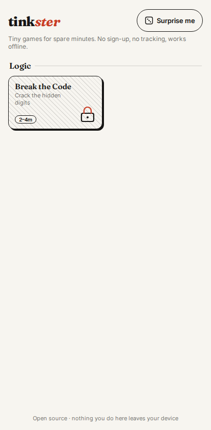
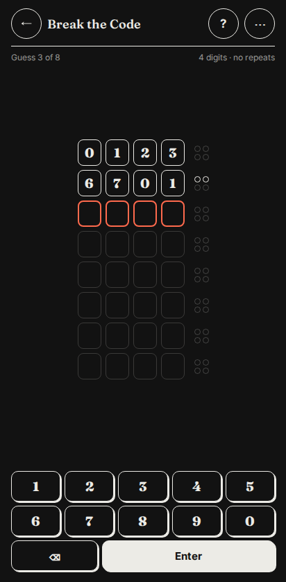

# tink*ster*

Tiny games for spare minutes: the checkout line, the waiting room.
Open it, play for two to fifteen minutes, forget about it.

- **No sign-up, no tracking, no ads.** Nothing you do leaves your device, and a test fails
  the build if the site ever contacts another server.
- **Works offline** after the first visit, and installs to your home screen.
- **One thumb.** Built for phones first; keyboard works on desktop.

Play: https://&lt;owner&gt;.github.io/tinkster/

## Games
| Game | What it is |
|---|---|
| Break the Code | Crack a hidden digit code from peg feedback (Mastermind with numbers). |

More are on the way: Letters & Numbers, Snake, Honeycomb, Emojigrams, Brick Breaker, Alien
Wave, Road Hop.

## Screenshots
| Home (light) | Break the Code (dark) |
|---|---|
|  |  |

## Run it
```bash
nvm use            # Node 22
npm ci
npm run dev -- --host
```

## How it's built
SvelteKit (Svelte 5) + TypeScript, prerendered to static files. Each game is one folder
that plugs into a shared game frame through a small typed contract. See
[docs/adding-a-game.md](docs/adding-a-game.md).

Quality is enforced by CI on every PR: strict types, lint, unit and property tests,
end-to-end tests on two phone sizes, accessibility (axe), visual regression, an offline
test, a privacy test and a size budget.

### Built with AI assistance
This project is developed with AI coding agents under human direction. Every feature goes
spec → plan → reviewed PR; the documents are in [docs/specs](docs/specs) and
[docs/plans](docs/plans), and every AI-assisted commit carries an `Assisted-by:` trailer.

## License
Code: MIT. Fonts and other third-party material: see [THIRD_PARTY.md](THIRD_PARTY.md).
